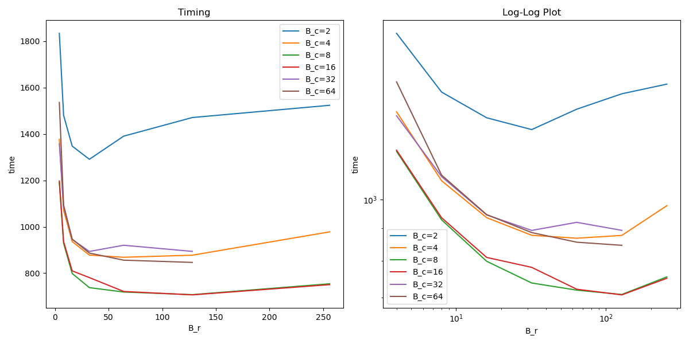
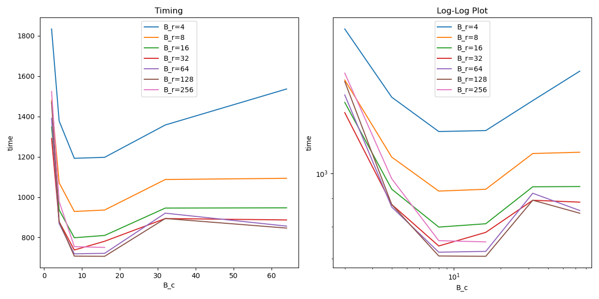
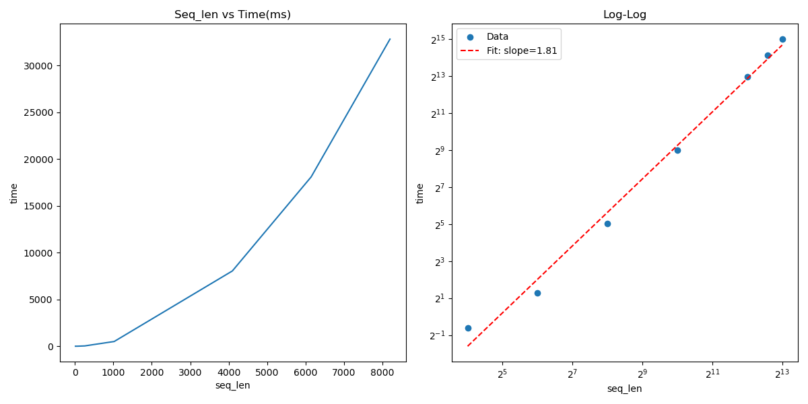
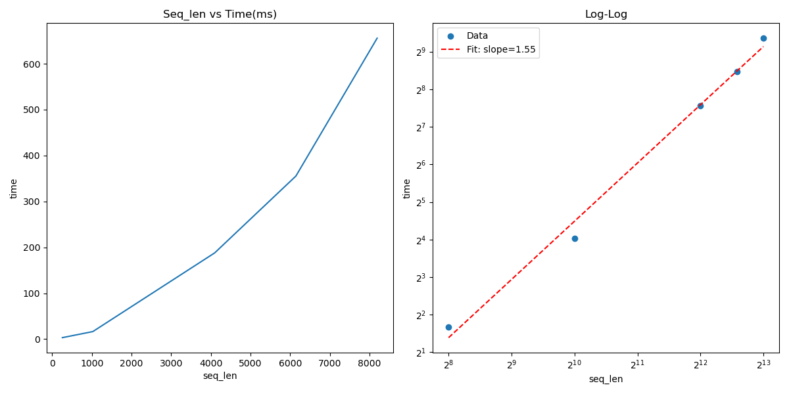
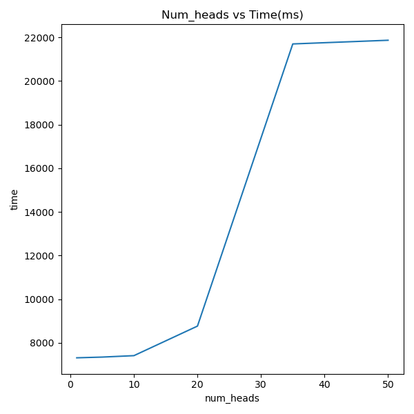
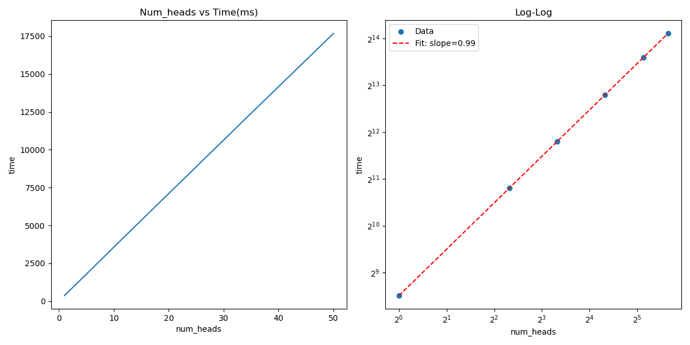

# CS 5220 Final: Flash Attention
Adhitya Polavaram (ap977), Alkis Boukas (ab2453), JT Klenke (jtk96)

[Link to code](https://github.com/lifchrs/CUDA-Flash-Attention)

## Introduction
Attention is a ubiquitous computation used in transformers. It processes a sequence of embeddings that each represent a token. Mathematically, it involves 3 sequence length by embedding dimension (shortened to $N\times d$) matrices, $Q$, $K$, $V$. The attention computation, $\text{softmax}(\frac{QK^T}{\sqrt{d}})V$, involves computing $QK^T=S$ a large $N\times N$ matrix and then computing a softmax operation over the rows of $S$ before finally multiplying by $V$ to yield a $N\times d$ output matrix. The softmax operation is defined for an $n$ dimensional vector $x$ as $\frac{\exp{x_i}}{\sum_{j=1}^n\exp{x_j}}$, an exponentiation of all entries vectors (in our case rows of $S$) and then a normalization. However, in order to maintain numerical stability in practice, we want to first subtract all values by the max of all values in the row, $m = \max_i(x_i)$. Note that this doesn't change the value of the softmax, and provides numerical stability by making sure that no exponent becomes too large. Given that the softmax operation involves two global values, the maximum and this normalization factor, it would seem that we'd be forced to materialize all of $S$ at once, but with clever updating we can instead keep a running value for the maximum and normalization factor and update past values. The final answer will be mathematically equivalent (although not equivalent in practice because of floating point rounding error). 

Since $N >> d$, with even longer sequence lengths being used by latest architectures, attentions matrices are typically tall and skinny which means that we want to avoid having to materialize all of $S$. We do this by tiling $Q, K, V$ into $B_r\times B_c$ sized tiles. Then we can make use of the tiles $Q_i, K_j$ to compute a tile of $S$, we keep a running value for the normalization factor and the maximum value for each row (two $B_r$ sized vectors), we can then use these values to update past tiles of the output matrix $O$. Since $\exp(x_i-m_{new}) = \exp(x_i)/\exp(m)$ we can update old values to reflect the new maximum value and similarly update the normalization factor, multiplying by the old factor and dividing by the new one. We do this for each tile, iteratively constructing the final output.

The advantage of this tiling technique comes from kernel fusion and a drastic reduction in the number of high bandwidth memory accesses (HBM, the larger but slower memory on the GPU). Naive computation of attention would use matrix multiplication that essentially only reads from HBM, which makes it memory bound. Instead, we use tiling to load a portion of $Q$, $K$, $V$, and write a portion of $O$ with all of these values residing in much faster shared memory (SRAM). The problem of having to correctly compute the softmax of the entire row even though we only have access to a tile of memory at a time is solved my the aforementioned exponent trick, where we keep track of the running maximum value and use them to update the row. This turns attention from a memory bottlenecked operation to one that (with the right tile size) is bottlenecked by the computations required in matrix multiplication.

Since attention is typically multiheaded (where the input matrix is instead a 3d tensor of independent, smaller attention computations) and batched (a series of independent instantiation of each 3d tensor), we included that in our implementation. These are both embarrassingly parallel because they offer independent computations of attention. 

In order to implement this algorithm in CUDA, we exploited the embarrassing parallelism across heads and batches by making our grid includes the number of heads and batch size as dimensions. This leaves each block having to handle $T_r$ (the number of tiles that span $Q$) tiles of computation. Then, we create a thread to handle each row of the tile. This allows each thread to work on building a row of $O_i$ independently and requires synchronization only when moving to the next block to make sure that all threads have finished with the memory in SRAM before it is replaced. This worked quite well, but we saw one further area of optimization - to have each block handle only one tile, by adding $T_r$ as the third dimension of the grid. This way, we add another dimension of parallelization that leads to each thread only needing to tend to exactly one row of the output matrix.

This strategy explicitly ties our launch parameters to our problem size. Specifically, our grid dim is $(\text{batch\_size}, \text{num\_heads}, T_r)$ and our block dim is $B_r$. The main area for further improvements would be to allocate more threads per block to assist with matrix multiply, however, we did not have enough time to get cutlass working (which uses all threads in the block to perform the matrix multiply) or to implement a more parallel version of matrix multiply.

## Scaling results

### Block scaling



This graph shows the effect of changing the block size on the speed of Flash Attention. $B_r$ is the height of the block (and the axis where we parallelize) and $B_c$ is the width of the block which obviously effects the total size of the block as well as the SRAM utilization. You can see that as $B_r$ increases the implementation gets faster (up to a point), this makes sense as the profiler results suggest that we are compute bound and have relatively low thread utilization, thus spawning more threads to do work on the blocks speed up the computation. 

We see that when $B_r$ becomes a multiple of 32, that the improvements level off, probably because then we achieve warp efficiency where all the threads are executing the same instructions.

The reason that $B_r$ eventually trends up seems to be cache effects because the l2 throughput doubles and the number of available registers to each thread halves from the $128\times 16$ to the $256\times 8$ (shown below), 
```
Metric Name                          Metric Unit    Metric Value
-------------------------------- --------------- ---------------
L1/TEX Cache Throughput              %              98.56
L2 Cache Throughput                  %              12.09
Block Limit Registers                block          16
Waves Per SM                                        4.94
-------------------------------- --------------- ---------------
L1/TEX Cache Throughput              %              98.78
L2 Cache Throughput                  %              26.38
Block Limit Registers                block          8
Waves Per SM                                        3.70
```
the issue is that the registers per thread decreases (since the blocks have more threads) and it seems that there are fewer blocks allocated per SM (since the number of waves per SM is higher). This suggests that the memory access patterns (of the registers) are a significant bottleneck given that even for a higher number of waves per SM, the smaller block size is still faster.



We seem there is a clear sweet spot for $B_c$. We would expect larger $B_c$ to perform better until SRAM has been fully utilized, this is because there is a roughly fixed cost to moving data from HBM to SRAM. As SRAM is quite small, moving data to it is dominated more by latency than throughput, therefore we would expect having more SRAM utilization to be strictly better as it reduces the total number of HBM accesses without trading the total number of computations. However, we don't see this. We hypothesize the reason is that our SMs are limited by memory, not thread count, this means that as we increase the size of the tile (without also increasing the thread count) our blocks resource requirement gets even more out of balance which means that each SM is using all of its memory but not all of its threads. For a theoretically compute bound operation like attention (which is largely matrix multiplies), this is a huge bottleneck. 

Consider the following profiling results, both for $B_r=32$ but with $B_c=8,32$ respectively (the larger is slower).

```
Metric Name                          Metric Unit    Metric Value
-------------------------------- --------------- ---------------
Dynamic Shared Memory Per Block      Kbyte/block           13.31
Achieved Active Warps Per SM                warp           10.58
Waves Per SM                                                5.39
-------------------------------- --------------- ---------------
Dynamic Shared Memory Per Block      Kbyte/block           28.67
Achieved Active Warps Per SM                warp            4.94
Waves Per SM                                               11.85
```

Unsurprisingly, we see that the shared memory per block is much lower for smaller tiles, this allows more active warps per SM which is where the speedup comes from (since this better balanced the resources in an SM). We can see that despite having fewer tiles (since each is larger), the number of waves per SM is larger, this suggests that for a smaller tile size we are able to schedule enough more concurrent blocks that it makes up for the fact that each block has to load values from $K_j, V_j$ more frequently.

### Sequence length scaling

Sequence length scaling before parallelizing over $Q_i$


Sequence length scaling after parallelizing $Q_i$


We see that the timing scales sub-quadratically in both cases but that scaling is better in the case where we spawn more blocks, this makes sense because it involves more parallelism along the scaling dimension. In both cases the scaling tends towards quadratic because attention is a quadratic operation in sequence length, thus, since parallelism eventually becomes constrained by GPU resources we would expect eventual convergence to quadratic (we can see in the log-log plot that the higher points have a larger slope, closer to quadratic).

### Attention Head & Batch Size Scaling
Since both the attention head and batch size are embarrassingly parallel, we would expect to see a scaling law that is roughly constant (ie ideal weak scaling). However, we see two different behaviors depending on the implementation. (For clarity the graphs will only show scaling of attention heads as it looks nearly identical to scaling for batch size.) Before implementing the optimization that spawned threadblocks for each $Q_i$ we saw the following scaling plot.



This shows roughly constant time until it jumps significantly, we hypothesize this is caused by having fewer blocks that could be maximally scheduled by the SMs, this means that adding more blocks directly creates opportunities for embarrassing parallelism. However, once the number of blocks gets high enough, there are more than can be simultaneously run which means that things begin to scale linearly. This also explains why it levels off again as the number of blocks will not lead to significant slowdowns until it triggers another wave. The comparatively small scaling is likely because of costs of moving memory to HBM that scale loosely with problem size. 



After spawning blocks for each $Q_i$, there are now significantly more blocks than can be simultaneously run on the SMs, this means that as we scale up the number of blocks, parallelism doesn't increase. This creates the perfect linear scaling we see as the number of waves per SM scales with the problem size.


### Performance Bottlenecks and Attempted Optimizations

When profiling our code, it became apparent that our naive matrix multiply algorithm was significantly impacting our code's performance and this is supported by multiple metrics. Firstly, for larger block sizes, we get the compute throughput is only 7.37%, which is far from optimal. Furthermore, the L1/TEX Cache Throughput is nearly at 100% and for very large blocks, even the L2 Cache Throughput starts to be significantly used. In contrast, smaller block sizes use about half of the L1/TEX Cache Throughput and nearly none of the L2 Cache Throughput. These metrics are all consistent with our understanding of the matrix multiply algorithm (as learned from Project 1 in this course).

Another bottleneck that we observed was a very low theoretical occupancy. Occupancy is the ratio of maximum active warps on an SM to the maximum supported concurrent warps on an SM. Our theoretical occupancy was being bottlenecked when we would increase $B_r, B_c$ or $d$ since these factors would increase the amount of memory we would allocate and the SM was being limited by the amount of shared memory, as the profiler shows:

```
Section: Occupancy
------------------------------- ----------- ------------
Metric Name                     Metric Unit Metric Value
------------------------------- ----------- ------------
Block Limit SM                        block           32
Block Limit Registers                 block            8
Block Limit Shared Mem                block            1
Block Limit Warps                     block            8
Theoretical Active Warps per SM        warp            8
Theoretical Occupancy                     %        12.50
Achieved Occupancy                        %        12.50
Achieved Active Warps Per SM           warp         8.00
------------------------------- ----------- ------------

This kernel's theoretical occupancy (12.5%) is limited by the required amount of shared memory.
```
Notably, these results tell us that we are also achieving optimal occupancy, meaning our loads are not imbalanced (so we're not spawning an entire warp for one thread). We believe that having more threads within a block to do work would increase our occupancy since they would be sharing the same memory already allocated (hence the number of blocks that can be placed on an SM remains constant), but more warps would be able to be launched.

We also noticed that depending on the launch parameters, the waves per SM would be a relatively large number (up to 19.55). This is because the number of blocks we spawn is proportional to the sequence length, number of heads, and batch size (all of which directly determine our launch parameters based on our parallelization). This would imply that if we could parallelize our code in such a way to minimize the number of blocks spawned (such as by merging blocks), it would speed up our implementation.


Spawning a threadblocks for each $Q_i$ sped up the implementation significantly, we can see in the scaling law of the sequence length before and after, the actual time is about 50x faster and also scales slightly better. The details as to why this scaling is effective are discussed in the scaling study.


One result that was concerning was the high usage of dynamic shared memory, but no usage of static shared memory. Since we were allocating the memory at runtime with command line arguments, we realized via ncu profiling (shown below) that all of our shared memory was dynamically allocated. 

```    
    Driver Shared Memory Per Block       Kbyte/block            1.02
    Dynamic Shared Memory Per Block      Kbyte/block           49.15
    Static Shared Memory Per Block        byte/block               0 
```

Since static shared memory should be faster than dynamic shared memory, we attempted to use it rather than dynamic shared memory. This involved changing the block of memory we were using inside the kernel to load $Q_i, K_j, V_j, O_i$ from
```cpp
extern __shared__ float sram[];
```
to
```cpp
constexpr int size = 2 * B_r * d + 2 * B_c * d;
__shared__ float sram[size];
```
This set the size of the SRAM at compile time allowing it to be static shared memory. However, we found this version of the code to be slower than the DRAM code. When profiling, we found that it used the exact same amount of dynamic shared memory as the old code, but it also used static shared memory. Interestingly, we got a 10-20% decrease in L1/TEX Cache Throughput. Despite this, we found that the compute throughput was lower and the waves per SM were significantly increased. The reason this is the case is because each SM stops processing blocks in parallel when it runs out of resources, such as threads or static/dynamic memory allocated. Since each block wants a relatively large chunk of SRAM and there is significantly less SRAM than DRAM, the number of blocks that can run concurrently is lowered. Therefore, despite each block runs faster with SRAM than with DRAM, more blocks need to run in serial, leading to the SRAM code having worse performance than the DRAM code.

This logic seems to imply that for parameters that result in less blocks (such as by decreasing the number of heads/batch size or increasing $B_r/B_c$), SRAM would become faster. Testing supports this idea as when we doubled both $B_r$ and $B_c$, our SRAM code caught up to our DRAM code.


| $d, B_c, B_r$ | SRAM time (ns)   | DRAM time (ns) |
| -------- | -------- | ------- |
| 16 64 32 | 3.19539e+07 | 2.13208e+07 |
| 16 64 64 | 3.39494e+07 | 2.25984e+07  |
| 16 128 64 | 3.52038e+07 |  3.71748e+07  |

### Comparison to PyTorch

PyTorch uses cuBLAS which is obviously an optimized matrix multiplication algorithm but that does not take advantage of the blocking and the fused kernel we can for our Flash Attention implementation. For PyTorch, we time both including the time to move the memory to and from the GPU and without. For our implementation we always include moving the memory to the GPU but measure with and without a warmup (which significantly reduces the time taken to transfer the memory). The other large advantage of Flash Attention is that blocking means that we can handle much larger size matrices because of blocking and the fact that we do not materialize the $N\times N$ attention matrix. 

Times are in ms.

|Batch Size| Num Heads | Sequence Length | Embedding Dimension | PyTorch (w/o transfer) | Ours (with warmup) | PyTorch (with GPU transfer) | Ours (no warmup)
|--|--|--|--|--|--|--|--|
|2|2|4096|32|19.309| 24.4337|497.18|270.294|
|4|4|4096|32|OOM| 73.9319|OOM|322.257|
|4|4|2048|32|59.883|25.1466 |539.560|282.098|
|4|4|2048|64|129.280| 56.9742|576.090|308.339|

### Future work

If we had more time, the main optimization would be using a library package for the matrix multiply operation in the kernel. CUTLASS (CUDA Templates for Linear Algebra Subroutines) implements all the relevant GEMM computations for C++ code inside of CUDA ```__global__``` functions. We attempted to get this package working, but it was throwing errors that we were unable to fix. We believe that CUTLASS would solve many of our bottlenecks, including our very large waves per SM and low theoretical warp utilization.

CUTLASS (or any optimized GEMM algorithm) would have a few optimizations, first, it makes use of all threads in the block to do the matrix multiplication, this would allow our blocks to make use of more threads on the same amount of memory which would mean that our SMs resource utilization (memory and threads) would be more balanced. Additionally, am optimized GEMM algorithm would make better use of the L1 and L2 caches, in many of the cases we profiled our L1 throughput was above 95% suggesting it was a bottleneck. The only time this wasn't the case was when we used static shared memory, however, in this case our theoretical warp utilization (and actual) is very low (~6%) and so would benefit from having more threads per block to increase this value and speedup the computation per block.

Some Resources Used:\
https://arxiv.org/abs/2205.14135 \
https://gordicaleksa.medium.com/eli5-flash-attention-5c44017022ad \
https://github.com/tspeterkim/flash-attention-minimal/ \
https://medium.com/@sthanikamsanthosh1994/introduction-to-flash-attention-a-breakthrough-in-efficient-attention-mechanism-3eb47e8962c3
