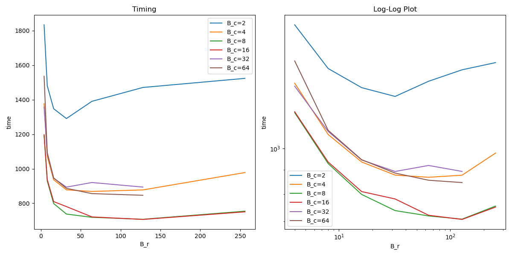

## Flash Attention: An Introduction
Attention is a ubiquitous computation used in transformers. It processes a sequence of embeddings that represent the tokens. Mathematically, it involves 3 sequence length by embedding dimension (shortened to $N\times d$) matrices, $Q$, $K$, $V$. The attention computation, $\text{softmax}(\frac{QK^T}{\sqrt{d}})V$, involves computing $QK^T=S$ a large $N\times N$ matrix and then computing a softmax operation over the rows of $S$ before finally multiplying by $V$ to yield a $N\times d$ output matrix. The softmax operation is defined for an $n$ dimentional vector $x$ as $\frac{\exp{x_i}}{\sum_{j=1}^n\exp{x_j}}$, an exponentiation of all entries vectors (in our case rows of $S$) and then a normalization. However, in order to maintain numerical stability in practice, we want to first subtract all values by the max of all values in the row, $m = \max_i(x_i)$. Note that this doesn't change the value of the softmax, and provides numerical stability by making sure that no exponent becomes too large. Given that the softmax operation involves two global values, the maximum and this normalization factor, it would seem that we'd be forced to materialize all of $S$ at once, but with clever updating we can instead keep a running value for the maximum and normalization factor and update past values. The final answer will be mathematically equivalent (although not equivalent in practice because of floating point rounding error). 

Since $N >> d$, with even longer sequence lengths being used by latest architectures, attentions matrices are typically tall and skinny which means that we want to avoid having to materialize all of $S$. We do this by tiling $Q, K, V$ into $B_r\times B_c$ sized tiles. Then we can make use of the tiles $Q_i, K_j$ to compute a tile of $S$, we keep a running value for the normalization factor and the maximum value for each row (two $B_r$ sized vectors), we can then use these values to update past tiles of the output matrix $O$. Since $\exp(x_i-m_{new}) = \exp(x_i)/\exp(m)$ we can update old values to reflect the new maximum value and similarly update the normalization factor, mutiplying by the old factor and dividing by the new one. We do this for each tile, iteratively contructing the final output.

The advantage of this tiling technique comes from kernel fusion and a drastic reduction in the number of high bandwidth memory accesses (HBM, the larger but slower memory on the GPU). Naive computation of attention would use matrix multiplication that essentially only reads from HBM, which makes it memory bound. Instead, we use tiling to load a portion of $Q$, $K$, $V$, and write a portion of $O$ with all of these values residing in much faster shared memory (SRAM). The problem of having to correctly compute the softmax of the entire row even though we only have access to a tile of memory at a time is solved my the aforementioned exponent trick, where we keep track of the running maximum value and use them to update the row. This turns attention from a memory bottlenecked operation to one that (with the right tile size) is bottlenecked by the computations required in matrix multiplication.

Since attention is typically multiheaded (where the input matrix is instead a 3d tensor of independent, smaller attention computations) and batched (a series of independent instantiation of each 3d tensor), we included that in our implementation. These are both embarissingly parallel because they offer independent computations of attention. 

In order to implement this algorithm in CUDA, we exploited the embarrassing parallelism across heads and batches by making our grid includes the number of heads and batch size as dimensions. This leaves each block having to handle $T_r$ (the number of tiles that span $Q$) tiles of computation. Then, we create a thread to handle each row of the tile. This allows each thread to work on building a row of $O_i$ independently and requires synchronization only when moving to the next block to make sure that all threads have finished with the memory in SRAM before it is replaced. This worked quite well, but we saw one further area of optimization - to have each block handle only one tile, by adding $T_r$ as the third dimension of the grid. This way, we add another dimension of parallelization that leads to each thread only needing to tend to exactly one row of the output matrix.

## Scaling results

### Block scaling

The reason that $B_r$ eventually trends up seems to be cache effects because the l2 throughput doubles from the $128\times 16$ to the $256\times 8$, the issue is that the regesters per thread decrases (since the blocks have more threads) and it seems that there are fewer blocks allocated per SM (since the number of waves per SM is higher).

This graph shows the effect of changing the block size on the speed of Flash Attention. $B_r$ is the height of the block (and the axis where we parelelize) and $B_c$ is the width of the block which obviously effects the total size of the block as well as the SRAM utilization. You can see that as $B_r$ increases the implementation gets strictly faster, this makes sense as the profiler results suggest that we are compute bound and have relatively low thread utilization, thus spawning more threads to do work on the blocks speed up the computation. In contrast, there is a sweet spot for $B_c$. We would expect larger $B_c$ to perform better until SRAM has been fully utilized, this is because there is a roughly fixed cost to moving data from HBM to SRAM. As SRAM is quite small, moving data to it is dominated more by latency than throughput, therefore we would expect having more SRAM utilization to be strictly better as it reduces the total number of HBM accesses without trading the total number of computations. However, we don't see this. We hypothesize the reason is that because of our naive matrix multiplication, when SRAM is full, the matrix multiply becomes slower because of cache effects, essentially we belive that higher levels of cache than SRAM are being poorly utilized because of our matrix multiply algorithm. 

We see that when $B_r$ becomes a multiple of 32, that the improvements level off, probably because then we achieve warp effeciciency where all the threads are exectuting the same instructions.